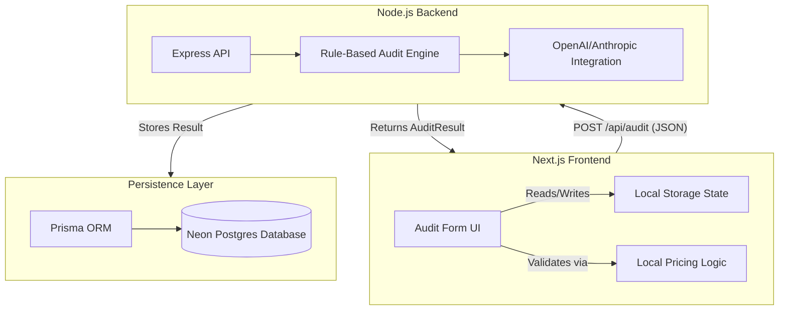

# Architecture & System Design

## System Diagram

## Data Flow: From Input to Audit Result

1. **User Input:** The user adds their AI tools, seats, and monthly spend into the React-based Audit Form.
2. **Client-Side Validation & Persistence:** The frontend immediately calculates expected market rates and persists the incomplete form state in `localStorage`.
3. **Submission:** Upon submission, the client sends a clean JSON payload (the `AuditInput` object, excluding non-essential UI state) to the `/api/audit` backend endpoint.
4. **Audit Engine Processing:** 
    - **Step 1:** Merges duplicate tool entries to sanitize inputs.
    - **Step 2:** Applies per-tool rules (e.g., "Are they overpaying compared to the official list price?").
    - **Step 3:** Applies overlap rules (e.g., "They have Cursor Pro and GitHub Copilot—recommend dropping one").
    - **Step 4:** Calculates total savings and a benchmark score based on team size.
5. **LLM Summary:** The engine passes the raw numeric savings and recommendations to an LLM to generate a human-readable executive summary paragraph.
6. **Database Persistence:** The `AuditResult` is saved to the Neon Postgres database via Prisma, generating a unique `shareId`.
7. **Client Rendering:** The frontend receives the response and redirects the user to `/audit/[shareId]` to view their customized report.

## Stack Choices

- **Next.js (React) for the Client:** Chosen for its robust router, excellent developer experience, and component-based structure. We opted for a SPA-like feel on the form using React state for dynamic updates.
- **Node.js/Express for the Server:** A lightweight server allows us to easily isolate the complex business logic (the audit engine) and LLM integrations from the frontend, ensuring API keys remain secure and the architecture can be decoupled if needed.
- **Neon Postgres + Prisma (`adapter-pg`):** Neon offers a serverless Postgres solution that pairs perfectly with modern edge deployments. Using Prisma with the `adapter-pg` ensures we don't run into connection pooling issues when deployed to environments like Vercel or Render.

## Scaling to 10k Audits/Day

If the application needed to scale to 10,000 audits per day, the current architecture would require the following changes:

1. **Decouple the LLM Call:** Currently, the LLM call is synchronous within the request cycle. At 10k/day, API rate limits and latency would cause timeouts. I would introduce a message queue (e.g., BullMQ or AWS SQS) and process the LLM summary asynchronously. The UI would poll or use WebSockets for the final summary.
2. **Database Read Replicas & Caching:** Generating the benchmark data relies on aggregating past audits. At 10k/day, doing real-time `COUNT` and `AVG` queries would degrade performance. I would implement Redis to cache the benchmark statistics and refresh them periodically.
3. **True Monorepo:** Moving to a tool like Turborepo would become necessary to strictly share TypeScript interfaces between the client, the backend, and background workers, preventing schema drift at scale.
4. **Edge Computing:** Shift the rule-based Audit Engine to execute entirely on Edge functions (like Cloudflare Workers), since it is purely computational. Only the database persistence and LLM queueing would need to touch a traditional server environment.
