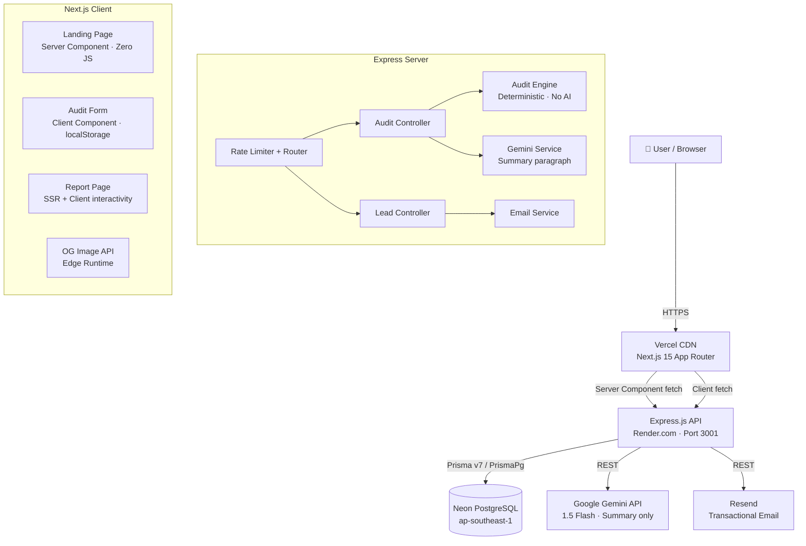

# ARCHITECTURE.md
**AI Spend Auditor — System Design**

---

## System Diagram



---

## Data Flow: Form Input → Audit Result

```
1. User fills form (8 tools × {plan, seats, monthlySpend}) + teamSize + useCase
      ↓ localStorage.setItem() on every keystroke (persistence)
      
2. Submit → POST /api/audit
   Payload: { tools: [...], teamSize: N, primaryUseCase: "coding" }
      ↓ Zod validation (strict schema)
      
3. AuditEngine.run(payload) — pure deterministic function:
   For each tool:
     a. Look up current plan price from pricingData map
     b. Run all applicable rules (9 rules):
        - planDowngradeRule (team plan for ≤2 users)
        - proPlusSeatRule (Pro+ vs Pro right-sizing)
        - cursorCopilotOverlapRule
        - cursorWindsurfOverlapRule
        - claudeChatGptTeamOverlapRule
        - windsurfCopilotOverlapRule
        - overpayDetectionRule (>15% above market)
        - benchmarkRule (compare to industry avg)
        - apiVsSubscriptionRule
     c. Return recommendation: { savings, reason, type, confidence }
   
   Aggregate:
     - totalMonthlySavings = sum of all tool savings
     - optimizationScore = 100 - (wastePercentage * 0.8) + bonuses
     - benchmarkPercentile = position vs industry avg table
     - biggestInefficiency = top recommendation by savings
      ↓

4. GeminiService.generateSummary(auditResult):
   - Build prompt with exact numbers from step 3
   - Call gemini-1.5-flash
   - On failure → use deterministic fallback template
      ↓

5. prisma.auditReport.create({ ...auditResult, shareId: nanoid(10) })
      ↓

6. Return { shareId } to client
      ↓

7. Client: router.push(`/report/${shareId}`)
      ↓

8. Report page: server-side fetch of /api/report/:shareId
   - Renders full results (recommendations, savings, benchmark)
   - Generates metadata for OG tags
   - Client component handles: copy link, email capture form
      ↓

9. User submits email → POST /api/lead
   - Honeypot check (bot rejection)
   - prisma.lead.create(...)
   - Resend: send confirmation email
```

---

## Why This Stack

| Decision | Choice | Reason |
|----------|--------|--------|
| Frontend | Next.js 15 App Router | SSR for report SEO + edge OG images + zero-JS landing for Lighthouse |
| Backend | Express.js | Clean Node.js env for Vitest, independent versioning, Prisma v7 driver adapter |
| Database | Neon PostgreSQL | Serverless connection pooling, standard SQL, free tier sufficient |
| ORM | Prisma v7 | Type-safe queries, schema-as-code, Neon adapter support |
| Styling | Tailwind CSS v4 | No templates, full design control, tree-shaken in production |
| Validation | Zod | Runtime + compile-time safety on all API boundaries |
| Email | Resend | Modern API, reliable delivery, free tier covers MVP volume |
| AI (summary only) | Gemini 1.5 Flash | Fast, cheap (~$0.0001/summary), sufficient for constrained summarization |

---

## What Changes at 10,000 Audits/Day

**Current architecture handles ~50-100 audits/day.** At 10k/day:

| Bottleneck | Current | At Scale |
|---|---|---|
| Database connections | Single pool, Neon free | Neon Pro with connection pooler (PgBouncer built-in) |
| Gemini API | Direct call per audit | Queue (BullMQ + Redis) — batch or async summary generation |
| Rate limiting | In-memory (single process) | Redis-backed rate limiter (ioredis) — survives restarts |
| Report fetching | Direct DB query | Redis cache with 1hr TTL on `report:{shareId}` |
| Express server | Single instance on Render | Render autoscaling or migrate to serverless (AWS Lambda + API Gateway) |
| OG images | Generated per request | Cache in Vercel CDN with `s-maxage` headers |
| Audit engine | Synchronous, in-process | Extract as standalone service — stateless, horizontally scalable |
| Lead emails | Synchronous with Resend | Async queue — email failures don't block the user response |

**At 10k/day, the architecture shifts from monolith to:**
- API gateway → audit worker pool (stateless) → results queue → DB writer
- Summary generation runs async, polled by client
- All external calls (Gemini, Resend) behind retryable queues with dead-letter handling
